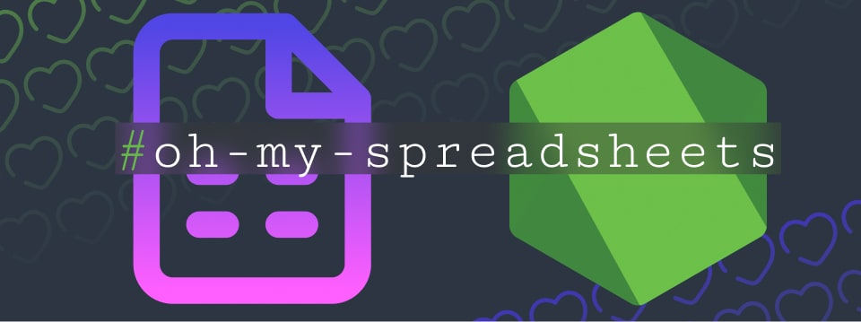

# Oh my spreadsheets
[](https://www.npmjs.com/package/oh-my-spreadsheets)
[](https://github.com/theStrangeAdventurer/oh-my-spreadsheets/actions/workflows/tests.yaml)
[](https://packagequality.com/#?package=oh-my-spreadsheets)



Easy to use and type-safe library that allows seamless interaction with Google Spreadsheets as if they were a database.
> Tip: Works exceptionally well with TypeScript

## Prerequisites

- To get started, you'll need to obtain a credentials file for your service account, which will be used to interact with your Google Spreadsheet. [link](https://thestrangeadventurer.com/kak-ispolzovat-google-sheets-v-kachestve-bazy-dannyh/) (My blog in Russian)

- After that you will need the `client_email` and `private_key` fields from the received file. 

## Quick start

> About storing secrets in Github: https://github.com/marketplace/actions/google-sheets-secrets-action#about-private-key
> You should replace all line breaks (`\n`) with real ones. If you are storing auth data in .env file you must enclose the value for the private key (from Google json file) in quotation marks, otherwise authorization will not work

- Install `oh-my-spreadsheets` as a dependency in your project `npm i oh-my-spreadsheets`

```typescript
import { Table } from "oh-my-spreadsheets";

const userSchema = {
    A: 'username',
    B: 'email'
} as const;

export const usersTable = new Table<typeof userSchema>(userSchema, {
    spreadsheetId: '<your-table-id>',
    sheet: '<sheet-name>', // any tab name (optional)
    email: '<service-account-email>',
    privateKey: '<service-account-private-key>',
});

// Receive rows 
const users = await usersTable.read({ limit: 10, offset: 0 });

// Receive all rows 
const users = await usersTable.read();

// Add row
await usersTable.create({
    data: { username: 'test', email: 'test@mail.com' }
});

// Update user email
await usersTable.update({
    where: { username: 'test' },
    data: { email: 'updated@mail.com' }
});

// Update any rows that have an empty email field.
await usersTable.update({
    where: { email: undefined },
    data: { email: 'defaultemail@mail.com' }
});

// Delete row
await usersTable.delete({
    where: { username: 'test' }
});

// Delete all rows
await usersTable.delete();
```
